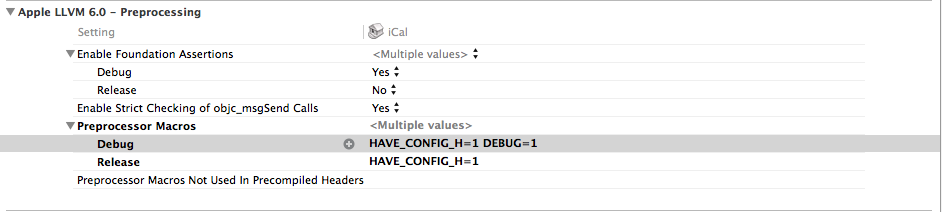

iCalUtil is a libical wrapper for ios.

It's used by [Kiwi Calendar](https://itunes.apple.com/app/id797639345) to speed up date calculating.

## Build
go to the source directory and running :

```
./build.sh
```

## Install

1. drag iCalUtil.framework to your xcode project
2. import `<iCalUtil/iCalUtil.h>`
3. add HAVE_CONFIG_H=1 to Preprocessor Macros as below



